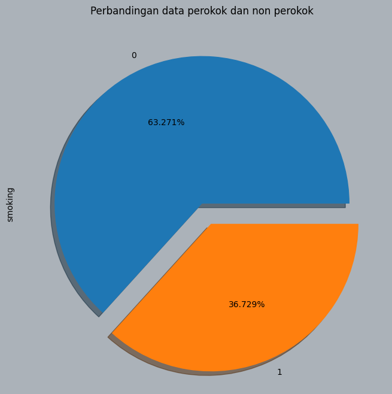
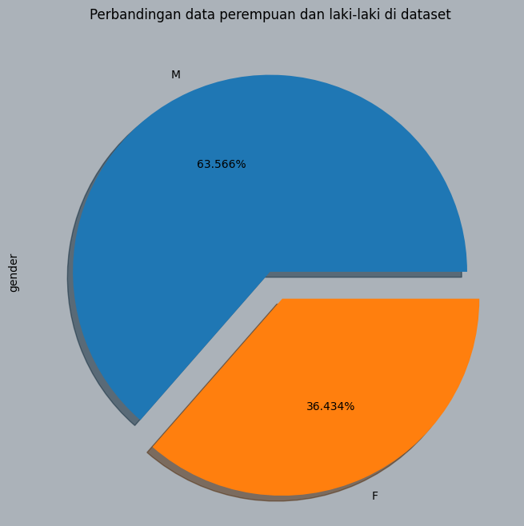
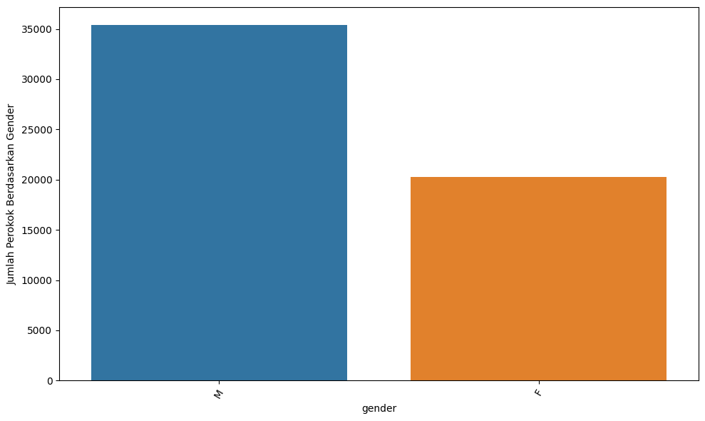
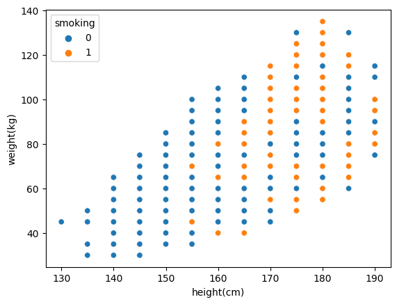
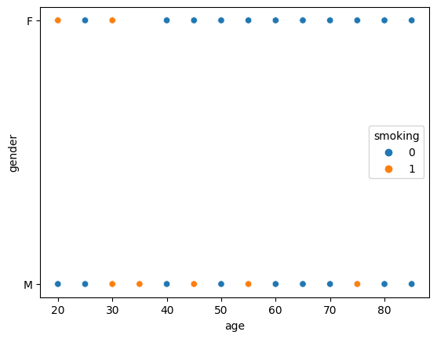
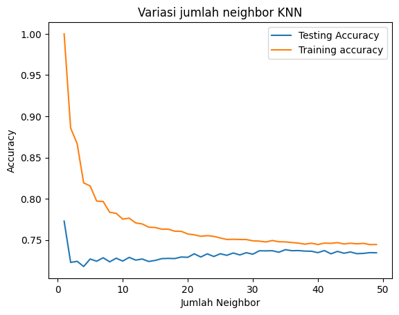
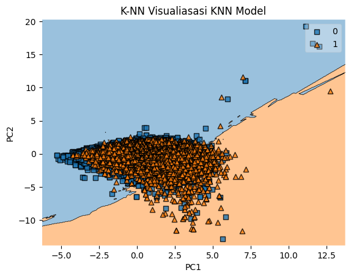
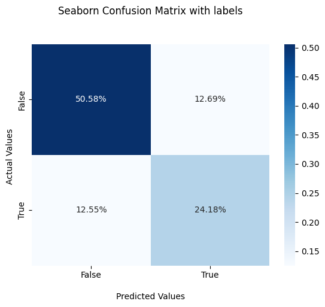
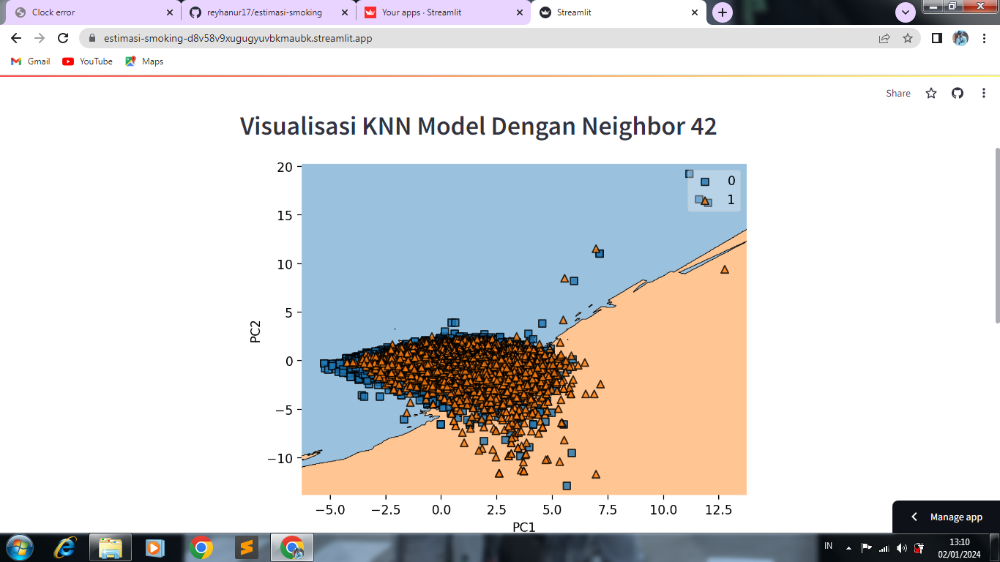
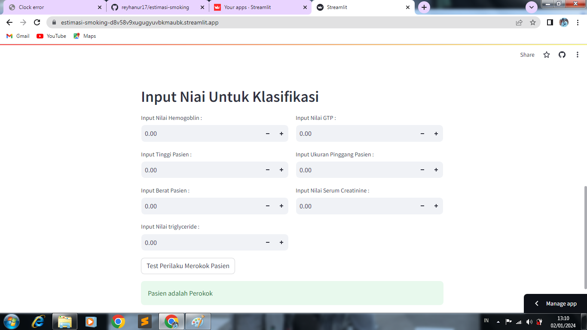

# Laporan Proyek Machine Learning

### Nama : Nur Muhammad Reyhan

### Nim : 211351106

### Kelas : Malam B

## Domain Proyek

Aplikasi ini bertujuan untuk membantu dalam menganalisis perilaku merokok menggunakan data kesehatan. Dengan menerapkan model machine learning, kita dapat mengidentifikasi pola dalam data kesehatan pasien/seseorang yang dapat menunjukkan keberadaan atau ketiadaan kebiasaan merokok pada pasien/seseorang.

## Business Understanding

### Problem Statements

- Bagaimana kita dapat menggunakan data kesehatan, untuk mengidentifikasi seseorang tersebut merupakan perokok?

### Goals

- Membangun model machine learning untuk mengklasifikasikan pasien/seseorang itu merupakan perokok.

### Solution statements

Solution Statement 1: Menggunakan algoritma K-Nearest Neighbors (KNN) untuk melakukan klasifikasi berdasarkan data kesehatan.

Solution Statement 2: Membuat visualisasi hasil klasifikasi untuk memudahkan tenaga medis atau peneliti.

## Data Understanding

Data yang digunakan dalam proyek ini berasal dari sumber [kaggle](https://www.kaggle.com/) dan berisi kumpulan data dasar sinyal biologis kesehatan.

<br>

Link Dataset : [Body signal of smoking](https://www.kaggle.com/datasets/kukuroo3/body-signal-of-smoking)

### Variabel-variabel pada Dataset ini adalah sebagai berikut:

- ID: Indeks (int64)
- Gender: Jenis kelamin (object)
- Age: Usia dengan selang lima tahun (int64)
- Height (cm): Tinggi badan dalam sentimeter (int64)
- Weight (kg): Berat badan dalam kilogram (int64)
- Waist (cm): Panjang lingkar pinggang (float64)
- Eyesight (left): Penglihatan mata kiri (float64)
- Eyesight (right): Penglihatan mata kanan (float64)
- Hearing (left): Pendengaran telinga kiri (float64)
- Hearing (right): Pendengaran telinga kanan (float64)
- Systolic: Tekanan darah sistolik (float64)
- Relaxation: Tekanan darah diastolik (float64)
- Fasting blood sugar: Gula darah puasa (float64)
- Cholesterol: Kolesterol total (float64)
- Triglyceride: Trigliserida (float64)
- HDL: Jenis kolesterol HDL (float64)
- LDL: Jenis kolesterol LDL (float64)
- Hemoglobin: Kadar hemoglobin (float64)
- Urine protein: Protein dalam urine (float64)
- Serum creatinine: Kreatinin dalam serum (float64)
- AST: Enzim AST (glutamic oxaloacetic transaminase) (float64)
- ALT: Enzim ALT (glutamic oxaloacetic transaminase) (float64)
- Gtp: Enzim GTP (γ-GTP) (float64)
- Oral: Status pemeriksaan oral (object)
- Dental caries: Karies gigi (int64)
- Tartar: Status tartar (object)
- Smoking: Kehadiran atau ketiadaan kebiasaan merokok (int64)

## Data Preparation

Dataset "Body signal of smoking" didapat dari website [kaggle](https://www.kaggle.com/)

disini saya akan mengkoneksikan ke kaggle menggunakan token API :

```bash
from google.colab import files
files.upload()
```

disni saya menyimpan file kaggle.json

```bash
!mkdir -p ~/.kaggle
!cp kaggle.json ~/.kaggle/
!chmod 600 ~/.kaggle/kaggle.json
!ls ~/.kaggle
```

disini saya mendownload file datasetnya :

```bash
!kaggle datasets download -d kukuroo3/body-signal-of-smoking
```

saya mengekstrak file dari dataset yang di download tadi :

```bash
import zipfile
zip_ref = zipfile.ZipFile('/content/body-signal-of-smoking.zip', 'r')
zip_ref.extractall('/content')
zip_ref.close()
```

lalu saya akan menggunakan beberapa library, akan saya import beberapa library yang akan digunakan :

```bash
import pandas as pd
import matplotlib.pyplot as plt
import seaborn as sns
#import sklearn.cluster as KMeans
from sklearn.cluster import KMeans
from sklearn.neighbors import KNeighborsClassifier
from sklearn.preprocessing import StandardScaler
from sklearn.model_selection import train_test_split
```

Disini saya akan meginputkan dataset ke variabel "df" :

```bash
df = pd.read_csv('CreditCardUsage.csv')
```

Saya akan cek 5 baris data awal pada dataset yang akan saya gunakan.

```bash
df.head()
```

Disini saya akan melihat semua tipe data yang ada pada dataset.

```bash
df.info()
```

lalu saya akan mengecek, apakah ada data null pada dataset.

```bash
df.isna().sum()
```

Disini saya akan memvisualisasikan korelasi antara variabel-variabel dalam DataFrame df dengan menampilkan koefisien korelasi dalam bentuk warna.

```bash
plt.figure(figsize=(20,10))
sns.heatmap(df.corr(),annot=True)
```


Kode dibawah digunakan untuk menghitung korelasi antara variabel-variabel dalam DataFrame df dengan variabel target 'smoking' dan kemudian menyusunnya dalam bentuk DataFrame.

```bash
correlation_matrix = df.corr()
correlations_with_target = correlation_matrix['smoking'].sort_values(ascending=False)
correlations_with_target.drop('smoking').to_frame()
```

lalu saya akan membuat diagram lingkaran (pie chart) yang membandingkan jumlah data antara perokok dan non-perokok.

```bash
plt.figure(figsize = [8, 8], clear = True, facecolor = "#ABB2B9")
plt.title("Perbandingan data perokok dan non perokok")
df["smoking"].value_counts().plot.pie(explode = [0, 0.15], autopct='%1.3f%%', shadow = True)
```


lalu saya juga akan membuat diagram lingkaran (pie chart) yang membandingkan jumlah data perempuan dan laki-laki di dataset.

```bash
plt.figure(figsize = [8, 8], clear = True, facecolor = "#ABB2B9")
plt.title("Perbandingan data perempuan dan laki-laki di dataset")
df["gender"].value_counts().plot.pie(explode = [0, 0.15], autopct='%1.3f%%', shadow = True)
```



lalu saya akan membuat diagram batang (bar chart) yang menunjukkan jumlah perokok berdasarkan jenis kelamin (gender)

```bash
n_credits = df.groupby("gender")["smoking"].count().rename("Count").reset_index()
n_credits.sort_values(by=["Count"], ascending=False, inplace=True)

plt.figure(figsize=(10,6))
bar = sns.barplot(x="gender",y="Count",data=n_credits)
bar.set_xticklabels(bar.get_xticklabels(), rotation=60)
plt.ylabel("Jumlah Perokok Berdasarkan Gender")
plt.tight_layout()
```



kode dibawah menjelaskan bagaimana kondisi berat badan dan tinggi badan terhadap kebiasaan merokok

```bash
sns.scatterplot(x="height(cm)",y="weight(kg)", hue="smoking", data=df)
```



dari kode di bawah kita mendapatkan informasi bahwa laki-laki cenderung memiliki kebiasaan merokok dalam jangka umur yang beragam. Sedangkan perempuan hanya merokok pada jangka umur 20-30 tahun saja

```bash
sns.scatterplot(x="age",y="gender", hue="smoking", data=df)
```



Pada tahap preprocessing ini, saya akan menjadikan feture smoking menjadi y dan fitur lain menjadi x.

```bash
features = ['hemoglobin','height(cm)','weight(kg)','triglyceride','Gtp','waist(cm)','serum creatinine']
x = df[features].values
y = df['smoking'].values
x.shape, y.shape
```

lalu saya akan menggunakan standardscaler, untuk melakukan normalisasi atau standarisasi pada data.

```bash
sc_x=StandardScaler()
x_train=sc_x.fit_transform(x_train)
x_test=sc_x.transform(x_test)
```

## Modeling

Disini saya akan memulai modelling dengan menggunakan algoritma KNN.

```bash
#import KNeighborsClassifier
from sklearn.neighbors import KNeighborsClassifier
import numpy as np

#Setup arrays to store training and test accuracies
neighbors = np.arange(1,50)
train_accuracy =np.empty(len(neighbors))
test_accuracy = np.empty(len(neighbors))

for i,k in enumerate(neighbors):
    #Setup a knn classifier with k neighbors
    knn = KNeighborsClassifier(n_neighbors=k)

    #Fit the model
    knn.fit(x_train,y_train)

    #Compute accuracy on the training set
    train_accuracy[i] = knn.score(x_train,y_train)

    #Compute accuracy on the test set
    test_accuracy[i] = knn.score(x_test, y_test)
```

dari kode dibawah menunjukkan bagaimana skor akurasi dengan berbagai jumlah neighbor. Jika kita lihat pada jumlah neighbor 2 memang memiliki akurasi yang tinggi pada data testing, namun pada data training nilai akurasinya sangat jauh berbeda. Kita juga melihat pada jumlah neighbor 41, jarak akurasi antara data training dan data testing sangat dekat, sehingga jumlah neighbor pada model klasifikasi kita adalah 41

```bash
plt.title('Variasi jumlah neighbor KNN')
plt.plot(neighbors, test_accuracy, label='Testing Accuracy')
plt.plot(neighbors, train_accuracy, label='Training accuracy')
plt.legend()
plt.xlabel('Jumlah Neighbor')
plt.ylabel('Accuracy')
plt.show()
```



## Evaluation

disini saya akan menggunakan kode dibawah ini untuk melatih, mengevaluasi, dan memvisualisasikan model KNN pada data yang sudah direduksi dimensinya menggunakan PCA.

```bash
from sklearn.decomposition import PCA

knn=KNeighborsClassifier(n_neighbors=41,metric='euclidean',p=2)
knn.fit(x_train,y_train)

pca = PCA(n_components=2)
X_train2D = pca.fit_transform(x_train)
X_test2D = pca.fit_transform(x_test)

from sklearn.metrics import accuracy_score
from mlxtend.plotting import plot_decision_regions

#K-NN + PCA
knn.fit(X_test2D, y_test)
y_pred_test = knn.predict(X_test2D)
precision_test = accuracy_score(y_pred_test, y_test) * 100
knn.fit(X_train2D, y_train)
y_pred_train = knn.predict(X_train2D)
precision_train = accuracy_score(y_pred_train, y_train) * 100
print("Akurasi Data Testing: {0:.2f}%".format(precision_test))
print("Akurasi Data Training: {0:.2f}%".format(precision_train))

#Plotting decision boundaries
plot_decision_regions(X_train2D, y_train, clf=knn, legend=1)
plt.xlabel('PC1')
plt.ylabel('PC2')
plt.title('K-NN Visualiasasi KNN Model')
plt.show()

#Output
#Akurasi Data Testing: 71.31%
#Akurasi Data Training: 72.20%
```



setelah melakukan reduksi dimensi menggunakan PCA (Principal Component Analysis), hasil outputnya "Akurasi Data Testing: 71.31%" dan "Akurasi Data Training: 72.20%" , Output tersebut menunjukkan bahwa model KNN, setelah dilatih pada data pelatihan dan diuji pada data uji, memiliki akurasi yang relatif baik.

setelah itu saya akan membuat confusion matrix nya.

```bash
from sklearn.metrics import confusion_matrix
import numpy as np

knn.fit(x_test,y_test)
x_test_prediction = knn.predict(x_test)

knn_matrix = confusion_matrix(y_test,x_test_prediction)
ax = sns.heatmap(knn_matrix/np.sum(knn_matrix), annot=True,
            fmt='.2%', cmap='Blues')

ax.set_title('Seaborn Confusion Matrix with labels\n\n');
ax.set_xlabel('\nPredicted Values')
ax.set_ylabel('Actual Values ');

## Ticket labels - List must be in alphabetical order
ax.xaxis.set_ticklabels(['False','True'])
ax.yaxis.set_ticklabels(['False','True'])

## Display the visualization of the Confusion Matrix.
plt.show()
```



```bash
# Confusion Matrix
TP = np.sum((y_pred_test == 1) & (y_test == 1))
TN = np.sum((y_pred_test == 0) & (y_test == 0))
FP = np.sum((y_pred_test == 1) & (y_test == 0))
FN = np.sum((y_pred_test == 0) & (y_test == 1))

# Akurasi
accuracy_manual = (TP + TN) / (TP + TN + FP + FN)
print("Akurasi (manual) Data Testing: {0:.2f}%".format(accuracy_manual * 100))

# Output
# Akurasi (manual) Data Testing: 71.31%
```

Dari hasil confusion matrix diatas, memiliki akurasi yang baik, karena mendapatkan akurasi 71.31%.

## Deployment

Berikut link menuju app [smoking-reyhan](https://estimasi-smoking-d8v58v9xugugyuvbkmaubk.streamlit.app/)


